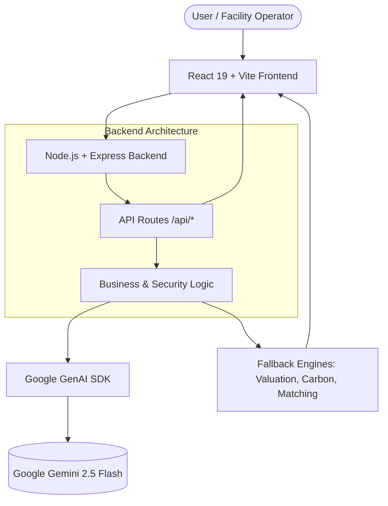

# Architecture Overview: Circulus Enterprise

This document provides a high-level overview of the Circulus Secure Enterprise Portal architecture.

## Stack Overview
- **Frontend**: React 19, TypeScript, Vite, Tailwind CSS v4, Framer Motion
- **Backend**: Node.js, Express, TypeScript
- **AI/LLM**: Google Gemini API (@google/genai)

## Core Principles
1. **Server-Side AI Security**: All Gemini AI processing occurs server-side to prevent credential leakage.
2. **Offline Resilience**: The system contains deterministic fallback engines (e.g., `valuation-engine.ts`, `carbon-engine.ts`) to ensure the platform remains functional if AI services are unreachable.
3. **Immutable Auditing**: Material movements are tracked using simulated cryptographic hashing (SHA-256 logic in `ledger-adapter.ts`).

## Directory Structure
- `/src/components`: UI modularized into distinct domains (auth, ledger, passport, scanner).
- `/src/lib`: Core business logic engines. These are isolated from the UI to ensure testability and separation of concerns.
- `/server.ts`: The Express API layer. It serves as an AI proxy, handles rate-limiting, and strips sensitive tokens from error messages.

## Data Flow (Material Passport Creation)
1. **Client**: User uploads an image via `/scanner`.
2. **Server**: Express receives the image payload and forwards it to Gemini 2.5 Flash.
3. **Server**: Gemini identifies the material composition, purity, and standard compliance.
4. **Server**: Data is returned to the client.
5. **Client**: A deterministic SHA-256 hash is generated, binding the AI assessment to the local timestamp and origin location.
6. **Client**: The Material Passport is minted into the local state engine.

## System Diagram

